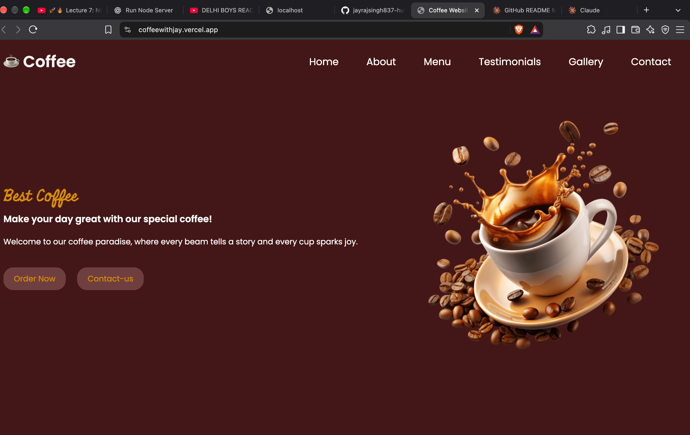
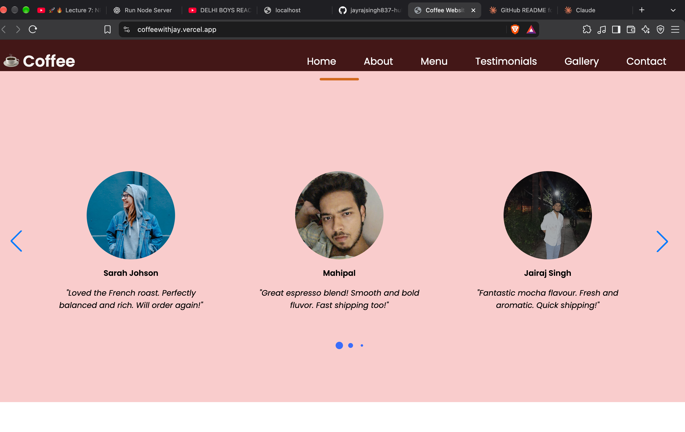

# ☕ Coffee Shop Website

A responsive, single-page landing website for a coffee shop, built with **HTML, CSS and vanilla JavaScript**. It includes a hero banner, about section, menu categories, a testimonials slider, an image gallery and a contact form.

> Built as a personal project while learning front-end web development as a 3rd-year B.Tech CSE student.

---

## 📸 Preview

<p align="center">
  
  
</p>
**Live demo:** (https://coffeewithjay.vercel.app/)

---

## ✨ Features

- **Responsive design** – layouts adapt for desktop, tablet and mobile using media queries (breakpoints at 1024px, 900px and 640px)
- **Mobile slide-in menu** – hamburger menu with blurred overlay, toggled with JavaScript
- **Smooth scrolling** – navigation links scroll smoothly to each section
- **Testimonials slider** – powered by [Swiper.js](https://swiperjs.com/) with looping, pagination bullets and navigation arrows
- **Menu section** – card-style layout for Hot Beverages, Cold Beverages, Refreshments, Combos, Desserts and Burgers & Fries
- **Gallery with hover zoom** – image zoom effect on hover
- **Contact section** – shop details plus a form with built-in HTML validation
- **Icons and fonts** – Font Awesome icons and Google Fonts (Poppins, Miniver)

---

## 🛠️ Tech Stack

| Technology | Purpose |
|------------|---------|
| HTML5 | Page structure and semantic markup |
| CSS3 | Styling, Flexbox, media queries, transitions |
| JavaScript (ES6) | Mobile menu toggle and Swiper initialisation |
| [Swiper.js v12](https://swiperjs.com/) | Testimonials carousel |
| [Font Awesome 7](https://fontawesome.com/) | Icons |
| Google Fonts | Typography |

---

## 📁 Project Structure

```
coffee-website/
├── images/              # Hero, menu, gallery and testimonial images
├── index.html           # Main page
├── index.css            # Styles
├── script.js            # Menu toggle + Swiper setup
└── README.md
```

## 📚 What I Learned

- Structuring a full landing page with semantic HTML
- Building layouts with Flexbox and making them responsive with media queries
- Using CSS transitions and hover effects
- DOM manipulation and event listeners in JavaScript
- Integrating third-party libraries (Swiper.js) via CDN

---

## 🔮 Future Improvements

- [ ] Connect the contact form to a backend or a service such as Formspree
- [ ] Add an online ordering / cart feature
- [ ] Add a lightbox for gallery images
- [ ] Add dark mode
- [ ] Improve accessibility (ARIA labels, keyboard navigation)
- [ ] Replace placeholder contact details with real shop information

---

## 🤝 Contributing

Suggestions and improvements are welcome. Fork the repo, create a branch, and open a pull request.

---

## 📬 Contact

**Your Name** – 3rd Year CSE Student
- GitHub: [@hyphe_jayy](https://github.com/jayrajsingh837-hub)
- LinkedIn: [](https://www.linkedin.com/in/jairaj-singh-863aa0406/)
- Email: [](jayrajsingh837@gamil.com)

